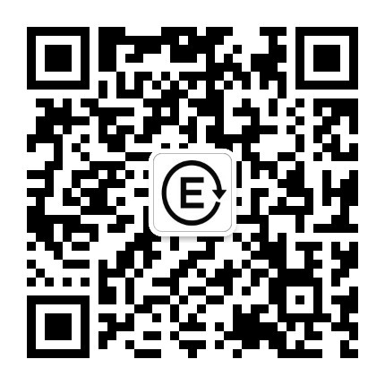

# Content Platform Analyzer

> 通用内容平台分析技能 - 帮助创作者深度分析内容质量、识别爆款模式、对标学习、制定增长策略

[](https://opensource.org/licenses/MIT)

## 特点

- 🔍 **内容理解优先** - 先读懂内容，再用数据验证
- 🎯 **平台无关** - 适用于公众号、小红书、知乎、博客等
- 📊 **格式灵活** - 支持JSON、Excel、Markdown、CSV等
- 🚀 **开箱即用** - 完整的4步分析框架 + 3模块报告模板
- 💡 **小样本友好** - 10-200篇文章即可获得洞察

## 快速开始

### 1. 安装技能

```bash
# 使用 npx 直接安装
npx skills add https://github.com/YOUR_USERNAME/content-analysis-skill
```

### 2. 准备数据

**最低要求**：
- 对标账号数据：10-50篇
- 自己账号数据：10-50篇
- 核心字段：标题、内容、阅读量

**数据格式**：JSON、Excel、Markdown、CSV均可

### 3. 开始分析

```
请加载 content-platform-analyzer 技能，分析我的公众号数据：articles.json
```
## 核心功能

### 4步分析框架

```
内容理解 → 数据验证 → 对标分析 → 建议生成
```

1. **内容理解** - 识别内容类型、爆款模式、主题分析
2. **数据验证** - 验证模式有效性、时间趋势、分位数分析
3. **对标分析** - 对比差距、识别优势劣势
4. **建议生成** - 标题/结构/技巧/策略优化建议

### 3模块报告

- **Module 1**: 对标账号内容深度解构
- **Module 2**: 自己账号内容质量诊断
- **Module 3**: 差距分析与增长建议

## 技术栈

- **核心依赖**：pandas、openpyxl（可选matplotlib/plotly）
- **不需要**：复杂NLP模型、机器学习、主题建模

**原因**：小样本用基础统计+规则分析即可，重点是"读懂内容"。

## 项目结构

```
content-platform-analyzer/
├── SKILL.md              # 技能主文件
├── references/           # 参考文档
│   ├── report-templates.md
│   └── analysis-methods.md
├── assets/               # 资源文件
│   └── qr-code.png      # 公众号二维码
├── README.md             # 本文件
└── LICENSE               # MIT
```

## 作者

**让你的内容创作更有数据支撑**

微信公众号：**让思考慢下来，让效率快起来**



## License

[MIT License](LICENSE)

---

<p align="center">
  <b>如果这个项目对你有帮助，请给个 ⭐️ 支持！</b>
</p>
